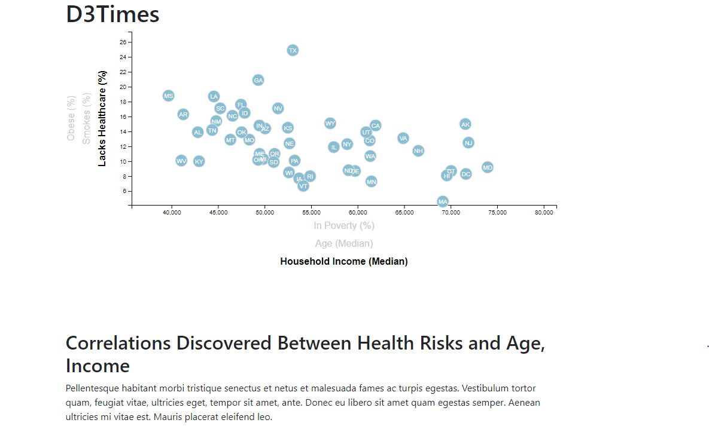

# D3-Challenge
### Summary
This repository contains an interactive map to explore scientific data about natural hazards by the United States Geological Survey(USGS). 
### Technical Details
In order to run the code, it is required: 
* Google Chrome, Firefox or any other Web browser 
* Utilizes both html and Javascript 
### Screenshots
ScreenShot.JPG 
  
### Explanations 
The outcome is shown in screenshots for reference purpose of the public. 

# D3-Challenge
Data Journalism and D3 

Analyze the current trends shaping people's lives. 
Create charts, graphs, and interactive elements to help readers understand the findings. 
The editor wants to run a series of feature stories about the health risks facing particular demographics. 
Sniff out the first story idea and sift through information from the U.S. Census Bureau and the Behavioral Risk Factor Surveillance System. 
The data set included with the assignment is based on 2014 ACS 1-year estimates:  https://factfinder.census.gov/faces/nav/jsf/pages/searchresults.xhtml. 
The current data set includes data on rates of income, obesity, poverty, etc. by state. MOE stands for "margin of error." 

Level 1: D3 Dabbler 

Create a scatter plot between two of the data variables such as Healthcare vs. Poverty or Smokers vs. Age. 
Create a scatter plot that represents each state with circle elements. 
Code this graphic in the app.js file and pull in the data from data.csv by using the d3.csv function.  
Include state abbreviations in the circles. 
Create and situate your axes and labels to the left and bottom of the chart. 

Note: Use python -m http.server to run the visualization. This will host the page at localhost:8000 in the web browser. 

Level 2: Optional Challenge 

1. More Data, More Dynamics 
Include more demographics and more risk factors.  
Place additional labels in your scatter plot and give them click events so that users can decide which data to display.  
Animate the transitions for your circles' locations as well as the range of the axes.  
Do this for two risk factors for each axis. Or, for an extreme challenge, create three for each axis. 

Hint: Try binding all of the CSV data to the circles. This will let the graph easily determine their x or y values when you click the labels. 

2. Incorporate d3-tip 
While the ticks on the axes allow developers to infer approximate values for each circle, it's impossible to determine the true value without adding another layer of data.  
Enter tooltips: developers can implement these in their D3 graphics to reveal a specific element's data when the user hovers their cursor over the element.  
Add tooltips to your circles and display each tooltip with the data that the user has selected. Use the d3-tip.js plugin developed by Justin Palmer—we've already included this plugin in your assignment directory. 

Check out [David Gotz's example](https://bl.ocks.org/davegotz/bd54b56723c154d25eedde6504d30ad7) to see how to implement tooltips with d3-tip. 

